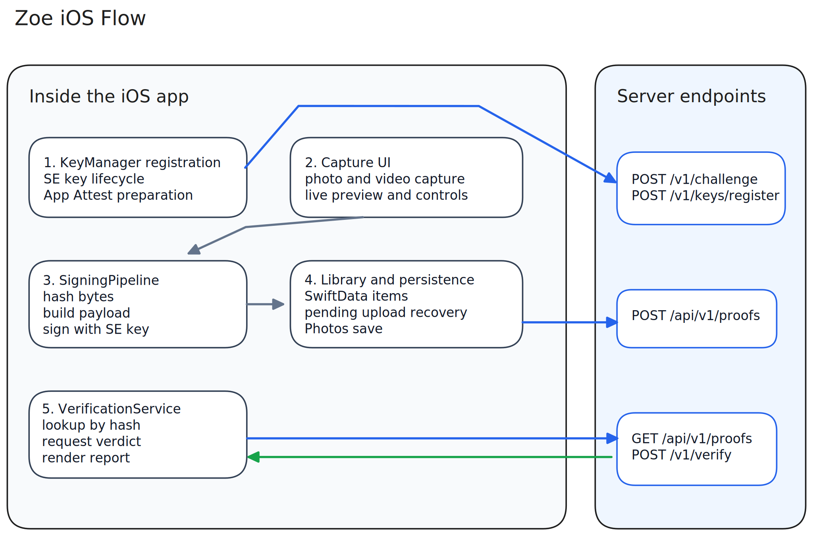

<h1 align="center">
  Zoe iOS
</h1>

<p align="center">
  <strong>Capture, sign, review, and verify provenance on device.</strong><br>
  Secure Enclave signing · App Attest registration · Detached proof upload · Server-backed verification
</p>

<p align="center">
  
  
  
  
  
</p>

<p align="center">
  
</p>

---

## What It Does

The Zoe iOS application is the user-facing boundary of the platform. It is responsible for:

- capturing photos and videos inside the app
- generating and holding a non-exportable signing key in the Secure Enclave
- registering that device key with the Zoe server using Apple App Attest
- constructing and signing a canonical `zoe.media.v1` payload
- uploading the signed proof bundle to the server
- storing captured or imported media locally in the app library
- verifying existing media against the server and presenting a user-readable verdict

**What the app does not claim:**

- it does not prove that a scene reflects reality
- it does not detect staging or semantic deception
- it does not provide offline legal-grade verification

---

## App Overview



Editable source: [ios/docs/diagrams/ios-flow.excalidraw](./docs/diagrams/ios-flow.excalidraw)

The active app architecture centers on:

- in-app capture and library surfaces
- Secure Enclave key lifecycle managed by `KeyManager`
- App Attest-backed registration against the Zoe server
- detached `zoe.media.v1` payload signing and proof upload
- server-backed verification with verdict rendering
- certificate-pinned networking and SwiftData-backed persistence

---

## Trust Model

From the app’s perspective, provenance is meaningful only when all of the following are true:

1. the app has a valid registered device key
2. the media hash is computed over the final encoded file bytes
3. the canonical `zoe.media.v1` payload is signed by the Secure Enclave key
4. the server accepts and stores the proof bundle
5. later verification finds a matching proof and the backend returns an authentic verdict

### Operational States In The App

| State | Meaning |
|---|---|
| `unsigned` | Capture succeeded, but the device was not able to sign |
| `pending` | Media was signed locally, but proof upload did not complete |
| `verifying` | A server verification request is in progress |
| `authentic` | The server confirmed the proof and content hash |
| `tampered` | A proof exists, but hash or signature validation failed |
| `not_verified` | No proof was found, or verification could not establish authenticity |

> The app is intentionally fail-open for capture. If registration or signing is unavailable, the original media is still preserved rather than blocking the user’s capture flow.

---

## App Architecture

### Core Modules

| Module | Purpose |
|---|---|
| `App/` | App bootstrap and shared app state |
| `Core/KeyManager/` | Secure Enclave key lifecycle, `kid` derivation, registration state machine |
| `Core/Signing/` | Payload construction and signing pipeline |
| `Core/Verification/` | Server-backed verification logic |
| `Core/Library/` | Library models, storage, and shared provenance UI components |
| `Networking/` | API models, endpoints, TLS-pinned client |
| `Features/Capture/` | Camera capture experience |
| `Features/Library/` | Library, media detail, and verdict surfaces |
| `Debug/` | Registration diagnostics for debug builds |

### Key Technical Decisions

| Decision | Current Approach |
|---|---|
| Device identity | Per-install Secure Enclave P-256 key |
| Registration gate | Apple App Attest |
| Payload format | Canonical `zoe.media.v1` JSON |
| Proof transport | Detached proof bundle uploaded to `/api/v1/proofs` |
| Verification | Hash lookup + `/v1/verify` round-trip |
| Local persistence | SwiftData |
| Transport security | TLS certificate pinning |

### Current Implementation Status

The application already includes the major POC/MVP surfaces:

- in-app capture for photo and video
- SwiftData-backed media library
- detached proof signing and proof upload
- proof re-upload handling for pending items
- server-backed verification and verdict UI
- certificate-pinned API client
- debug-only registration diagnostics
- accessibility identifier coverage for the implemented UI surface

---

## Requirements

| Requirement | Detail |
|---|---|
| iOS | 17.0 or later |
| Hardware | iPhone hardware with Secure Enclave |
| App Attest | Real device required for actual attestation |
| Network | Required for registration, proof upload, and verification |
| Xcode | Current modern Xcode capable of building Swift 5.9+ app targets |

### Device And Simulator Expectations

- Simulator is suitable for UI work, library flows, and much of the app development loop.
- Real-device testing is still required for App Attest and genuine Secure Enclave registration behavior.
- Verification UX should be validated against the live backend because the app depends on proof lookup and verification responses.

---

## Testing

The iOS codebase includes both unit and UI coverage.

### Unit Test Coverage

- API client and transport behavior
- key management and registration state handling
- signing pipeline and canonical payload construction
- verification service behavior
- library storage and view-model logic

### UI Test Coverage

- capture flow
- library surface
- media detail view
- verdict view

### Quality Gates

- clean simulator build
- unit and UI tests passing
- accessibility identifiers updated and exercised on the simulator
- real-device validation for registration-sensitive changes

For iOS-specific standards and registry details, see [ios/docs/accessibility-identifiers.md](docs/accessibility-identifiers.md).

---

## Project Layout

```text
ios/
├── Zoe.xcodeproj
├── Zoe/
│   ├── App/
│   ├── Core/
│   │   ├── Accessibility/
│   │   ├── KeyManager/
│   │   ├── Library/
│   │   ├── Shared/
│   │   ├── Signing/
│   │   └── Verification/
│   ├── Debug/
│   ├── Features/
│   │   ├── Capture/
│   │   └── Library/
│   ├── Networking/
│   └── Assets.xcassets/
├── ZoeTests/
└── ZoeUITests/
```

---

## Related Documents

- [iOS docs index](docs/README.md)
- [Accessibility identifiers standard](docs/accessibility-identifiers.md)
- [Cross-cutting product docs](../docs/README.md)
- [Spec freeze](../docs/spec-freeze.md)
- [Schema v2 proposal](../docs/schema-v2-proposal.md)

---

## Scope And Non-Claims

This application is part of a POC/MVP platform.

The following are not yet represented as finished product commitments:

- offline verification with self-contained evidence
- mature multi-platform clients beyond iOS
- trusted transcoding and downstream derivation receipts
- account, tenancy, or enterprise policy management
- courtroom-grade or regulatory-grade evidence packaging

---

## Disclaimer

Zoe iOS is intended for provenance research, product development, and operational validation. It can support a claim that a file was handled by the Zoe workflow and has not changed since signing under the current platform rules. It does not prove that a scene was truthful or unstaged.
